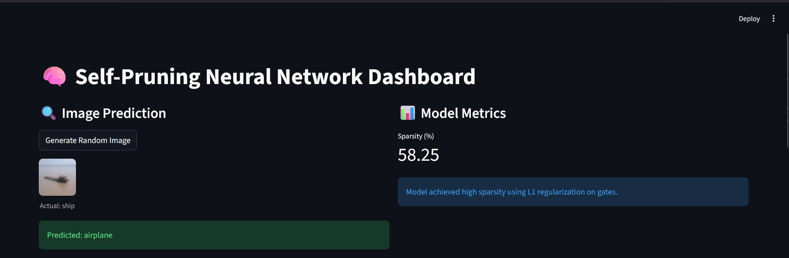
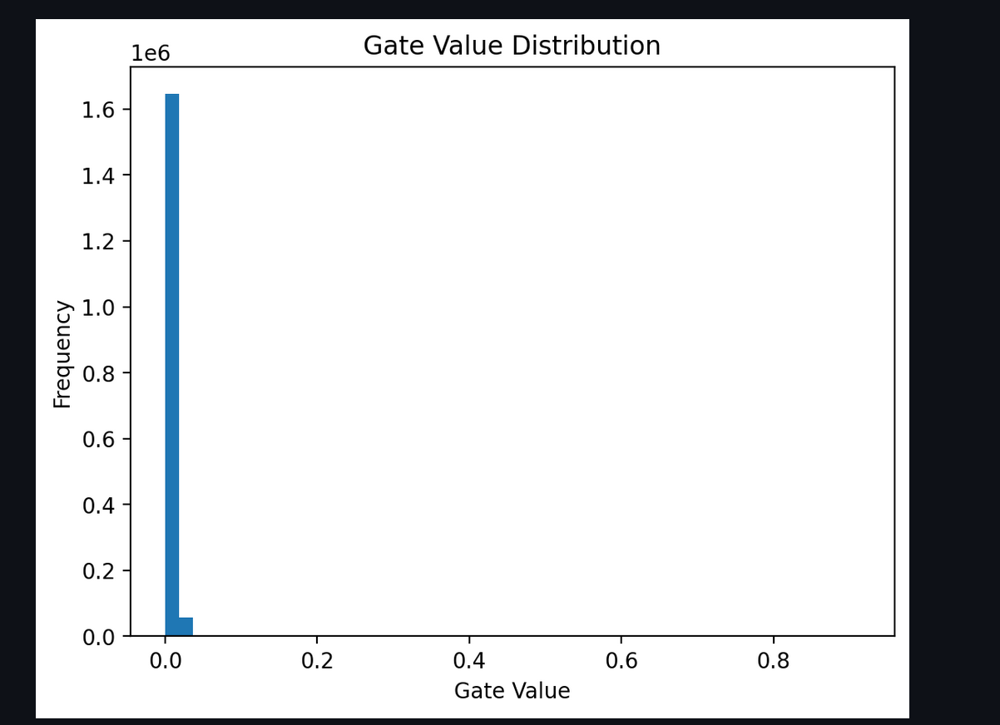

# 🧠 Self-Pruning Neural Network Dashboard


---

## 🚀 Overview

This project implements a **Self-Pruning Neural Network** that dynamically removes unimportant weights during training using learnable gating mechanisms.

Unlike traditional pruning (post-training), this model **learns sparsity during training**, making it more efficient and adaptive.

---

## 🧠 Key Idea

Each weight is controlled by a learnable gate:

pruned_weight = weight × sigmoid(gate_score)

- Gate ≈ 1 → Important weight ✅  
- Gate ≈ 0 → Pruned weight ❌  

---

## ⚙️ Loss Function

Total Loss = CrossEntropyLoss + λ × L1(gates)

- CrossEntropy → ensures model accuracy  
- L1 Regularization → enforces sparsity  

---

## 📊 Results

| Lambda | Accuracy | Sparsity |
|--------|---------|----------|
| 1e-5   | ~55%    | ~5%      |
| 1e-4   | ~50%    | ~30%     |
| 1e-3   | **44.84%** | **58.25%** |

---

## 📈 Observations

- Lower λ → High accuracy, low sparsity  
- Higher λ → High sparsity, lower accuracy  
- Optimal λ balances both  

👉 At λ = 1e-3, the model achieved **~58% sparsity** while maintaining acceptable accuracy.

---

## 🧪 Features

- ✅ Custom PyTorch layer (`PrunableLinear`)
- ✅ Learnable gate-based pruning
- ✅ L1 sparsity regularization
- ✅ CIFAR-10 dataset training
- ✅ Gate distribution visualization
- ✅ FastAPI deployment
- ✅ Streamlit interactive dashboard

---

## 🖥️ Dashboard

### Run the dashboard:

```bash
streamlit run app.py

## 📸 Dashboard Preview

### 🔹 Main Interface


### 🔹 Gate Distribution
